# Job Postings Analysis

## Introduction

Using a dataset of data science job postings from 2023, collected and compiled by Luke Barousse from different job posting platforms, I created the interactive salary dashboard shown below.


## Data Science Salary Dashboard
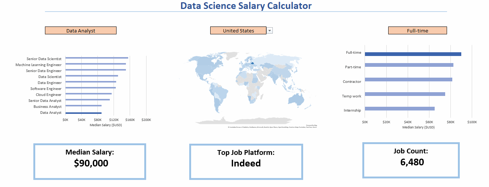  
This dashboard consists of two main components:

* **Charts**, which make it easy to observe and compare the median salaries of data science jobs based on job title, country, and job schedule type.
* **Cards**, which display the median salary, the top job posting platform, and the total number of job postings based on the selected filters.

## Excel Skills Used
### Data Validation:
A dedicated Data Validation worksheet was created to provide filtered lists of valid values for the Job Title, Country, and Job Schedule Type fields. These lists are used as data validation rules, ensuring that users can select only predefined values. This helps prevent invalid input and unexpected errors.
### Formulas and Functions:
- **Median**: The median salary is calculated based on the values selected in the option cells using the following formula:

    ```excel
    = MEDIAN(
    IF(
    (data_job_posts[job_title_short]=A2)*
    (data_job_posts[job_country]=country)*
    ISNUMBER(SEARCH(type,data_job_posts[job_schedule_type]))*
    (data_job_posts[salary_year_avg]<>0),
    data_job_posts[salary_year_avg]
    ))
    ```

- **Count:** The number of job postings that match the selected options is calculated using the following formula:

    ```excel
    = COUNT(
    IF(
    (data_job_posts[job_title_short]=Data_Validation!$A2)*
    (data_job_posts[job_country]=country)*
    ISNUMBER(SEARCH(type,data_job_posts[job_schedule_type])), 1
    ))
    ```
    This count is used to create the Job Count card. It is also used to sort the values in the Job Title data validation list in descending order based on the number of matching job postings.

- **XLOOKUP:** To retrieve the values displayed on the dashboard cards, the XLOOKUP function is used. For example:

    ```excel
    =IF(ISNUMBER($I$2),XLOOKUP(title,D2:D11,E2:E11),"No Data Found")
    ```
    The **IF** function prevents errors from being displayed on the dashboard. If no matching data is found for the selected options, the formula returns "No Data Found" instead of an error value.

- **FILTER:** The FILTER function is used to generate the list of valid Job Schedule Type values in the Data Validation worksheet. It filter out schedule types that contain more than one type by eliminating those that contain "and", as all multi-type job schedule specifications include the word "and".

    ```excel
    =FILTER(M2#,NOT(ISNUMBER(SEARCH("and",M2#)))*(M2#<>0))
    ```

- **SORT:** The SORT function is used to arrange data in descending order, making bar charts easier to interpret, ranking job titles by popularity, and retrieving desired values much quicker.

    ```excel
    =SORT(A2:B11,2,-1)
    ```
    This formula sorts the job titles by their job counts in descending order.

- **SUBSTITUTE:** It used to clean the **Top Job Platform** value by removing the prefix **"via "** from the platform name.
    
    ```excel
    =IF(E2<>0,SUBSTITUTE($D$2,"via ",""),"No Platform Found")
    ```
    If no matching platform is found, the formula returns "No Platform Found" instead of displaying invalid value.


### Charts:
- **Bar Charts:**   
    <br>
    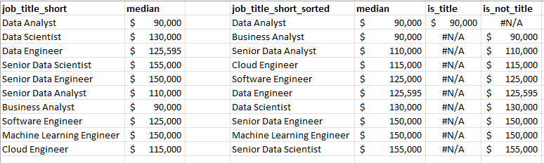  

    The median salary for each job title is calculated based on the selected option values and then sorted in ascending order to create the following bar chart:  
    <br> 
    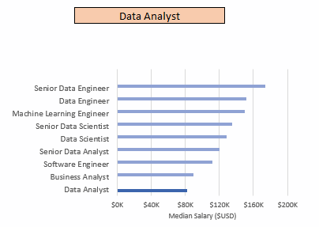 

    As above, the median salary is calculated for each job schedule type and then sorted in ascending order to create the following bar chart:  
    <br>
    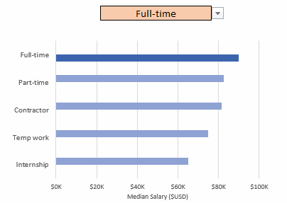  

- **Map Chart:**
    The median salary for each country in the dataset is calculated based on the selected option values and displayed on the following map chart:  
    <br>

    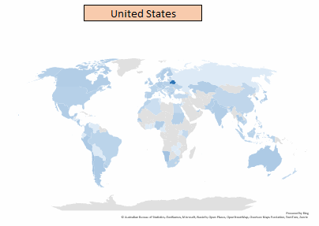


# Exploratory Data Analysis(EDA)
## Analysis Questions:
1. Do more skills lead to higher salary?
2. What are the top skills needed for people in  Data field?
3. what is the pay for the top skills needed in a certain job title?
4. Which jobs are most suitable for remote work?

## Excel Skills Used:
### Power Query:
Power Query used to make ETL (Extract, Transform and load) as follows:
1. **Extract**: First, Power Query used to extract original dataset, then i created to queries from it:
    - data_jobs_all
    - data_job_skills
2. **Transform**: Then both queries are manipulated and cleaned by these following steps:
    - data_jobs_all:  
    <br>
    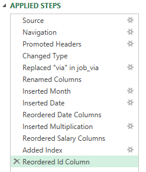
    - data_job_skills:  
    <br>
    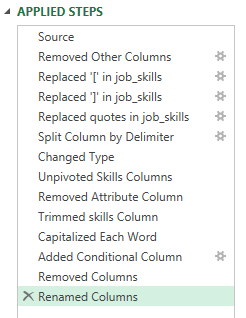
3. **Load**: Finally, both queries are loaded to the workbook as connection only for further analysis.

### Power Pivot:
- **Data Modeling**: In order to create more powerful pivot tables and charts, i used Power Pivot to create a Data Model as follows:  
<br>
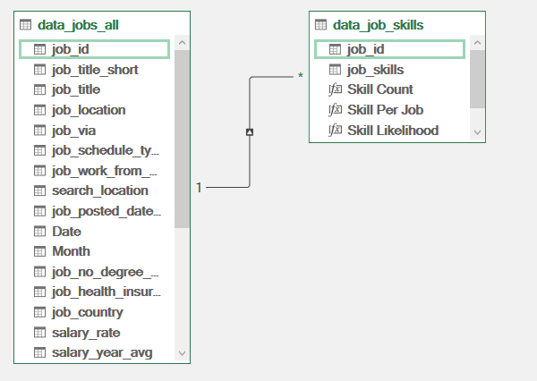  
data_jobs_all and data_job_skills connected by a one-to-many relationship using job_id, where job_id are a primary key in data_jobs_all, and foreign key in data_job_skills.

- **DAX**: Data Analysis Expressions(DAX) are used to create Measures for both tables. below are some Measures created using DAX:
    ```excel
    Job Count:= DISTINCTCOUNT(data_jobs_all[job_id])
    ```
    Count measure, count the number of jobs with distinct job_id values.
    ```excel
    Skill Per Job:= DIVIDE([Skill Count],[Job Count])
    ```
    DIVIDE function used instead of simple division expression, because DIVIDE function handles divide by zero error.
    ```excel
    Median Salary - Skill:= CALCULATE([Median Salary],CROSSFILTER(data_jobs_all[job_id],data_job_skills[job_id],Both))
    ```
    Since the relationship in the data model is configured as a one-way relationship, As a result, filters originated from data_job_skills cannot propagate back to data_jobs_all. Therefore,to enable filtering in both directions for this calculation, the CROSSFILTER DAX function is used within CALCULATE to temporarily change the relationship direction to Both using the job_id column.

## Analysis:
### Do more skills lead to higher salary?
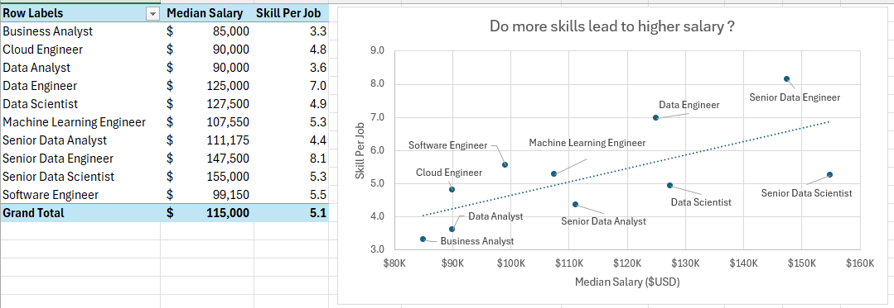  
Although a higher number of required skills generally corresponds to higher salaries, data science and analysis roles require significantly fewer skills than data engineering roles while offering similar levels of pay(ex: as in Data analysis and Cloud Engineer).

### What are the top skills needed for people in Data field?
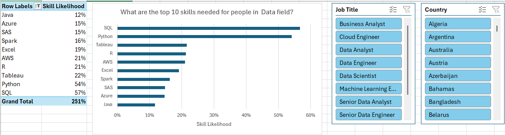  
As we can see, SQL and Python are the most high-demand skills needed across all Data jobs.  

### what is the pay for the top skills needed in Data field?
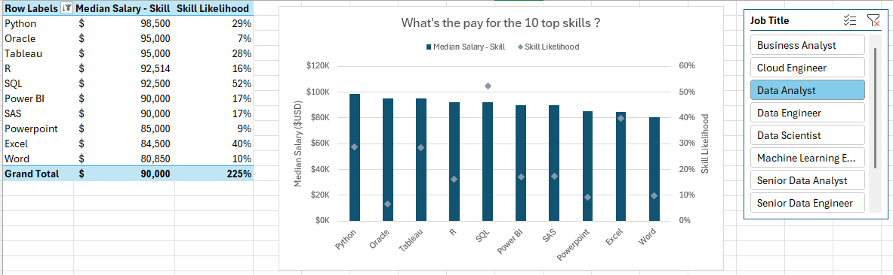  
For Data Analysis jobs, learning high-demand skills like Python and SQL, are tied to higher Salary.

### Which jobs are most suitable for remote work?
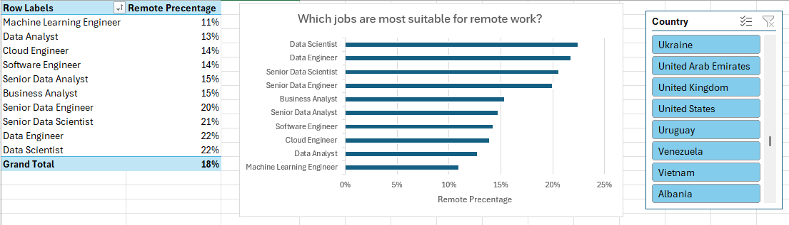  


